# Relay

**Your own community chat platform. Voice, video, and text — running on your hardware, not someone else's.**

Relay is a self-hosted alternative to the big community-chat services. Same shape you already
know (servers, channels, roles, voice rooms), but you run it, you own the data, and nobody
gets to mine your conversations or change the rules on you. One `docker compose up` and it's
yours.

It ships two ways from the same codebase: open it in a browser, or install the native desktop
app. Pick whichever you like — they're the same Relay.

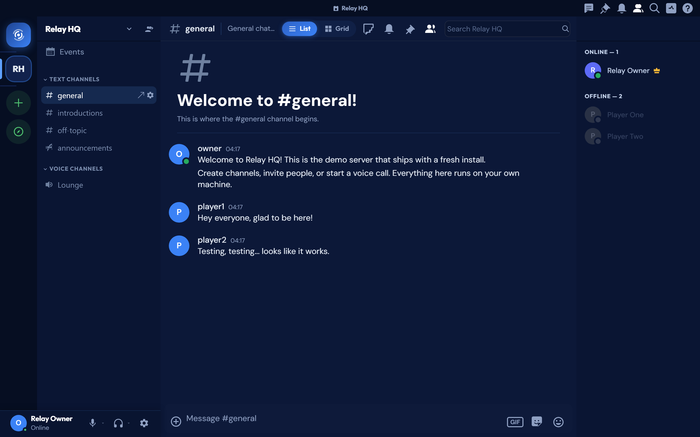

## Web or desktop — same app, your choice

This is the part most self-hosted projects skip. Relay's client runs **in any modern browser**
and **as a native desktop app** for Windows, macOS, and Linux, built from one React codebase.
No feature-gap between them, no "download our app to unlock" nonsense.

| In your browser | As a desktop app |
|---|---|
|  | 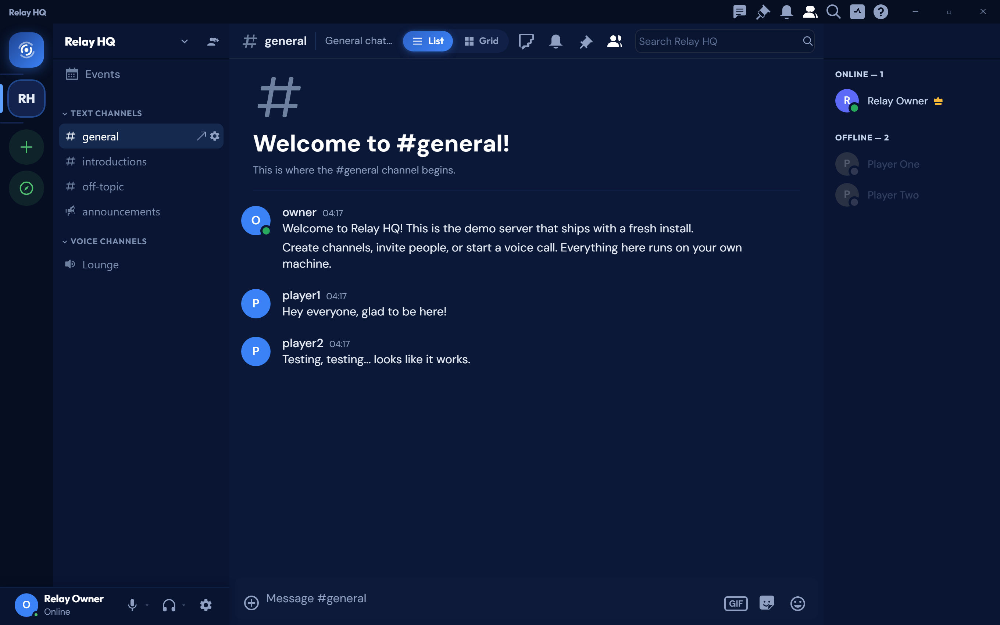 |

Point a browser at your server and you're in. Or grab the desktop build for the things a
browser can't do as well: a proper system-tray presence so Relay keeps running when you close
the window, a real "pick a window or a screen" chooser when you go live (not just "share your
whole desktop"), and system-audio capture on Windows so people hear the game, not just you.

## Why bother self-hosting

Most community platforms want you to hand them your members' messages, voice calls, and files,
then trust them with it. Relay is the opposite deal. It's a complete stack you run yourself —
gateway, voice/video, API, storage, search, and client — so the whole thing lives on your box.
Your data never leaves it. There's no account with a third party, no telemetry phoning home,
and no surprise policy change three months from now.

## What you get

**Voice that actually sounds good.** Opus in stereo at 48 kHz, up to 512 kbps per channel
(64 by default), with error correction so a dropped packet doesn't turn everyone into a robot,
and DTX so silence doesn't waste bandwidth. It runs on a mediasoup SFU, so a busy voice channel
routes efficiently instead of melting the host.

**Video and screen sharing built for gaming.** HD webcam video with 3-layer simulcast — every
viewer automatically gets the quality their connection can handle. Screen share goes up to
4K30 or 1080p60 at 10 Mbps, and on Windows it captures system audio too. In the desktop app you
choose exactly which screen or window to share.

**Chat that keeps up.** Real-time delivery over an Elixir/OTP gateway, presence and typing
indicators, threads, reactions, file uploads, DMs and group DMs, and full-text search across
everything (Elasticsearch under the hood).

**The community tools you need to run a real server.** Categories, text and voice channels,
forums, and announcement channels. Roles with granular permissions. AutoMod keyword rules,
kick/ban, and an audit log so moderators can see what happened. Scheduled events and invites.

**Self-hosted, top to bottom.** Postgres, Redis, Elasticsearch, and MinIO all come up with the
rest of the stack in Docker Compose. Nothing external to sign up for. The source is available
under a noncommercial license, so you can read exactly what you're running and change it.

## A look inside

| Chat, reactions & GIFs | The GIF picker (GIPHY) |
|---|---|
| 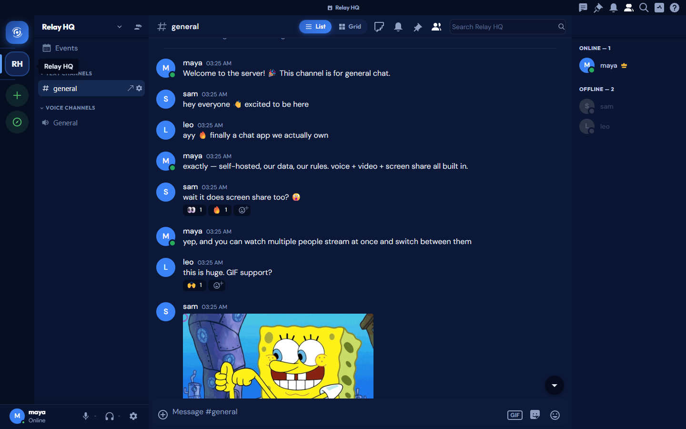 | 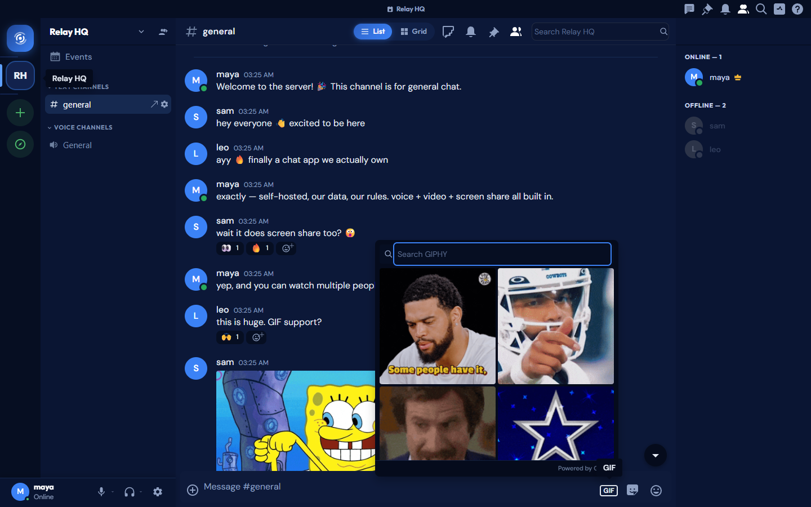 |

| Stickers | Custom emoji |
|---|---|
| 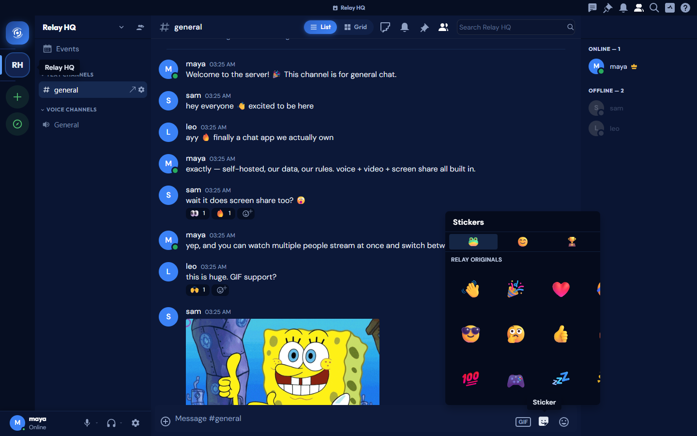 | 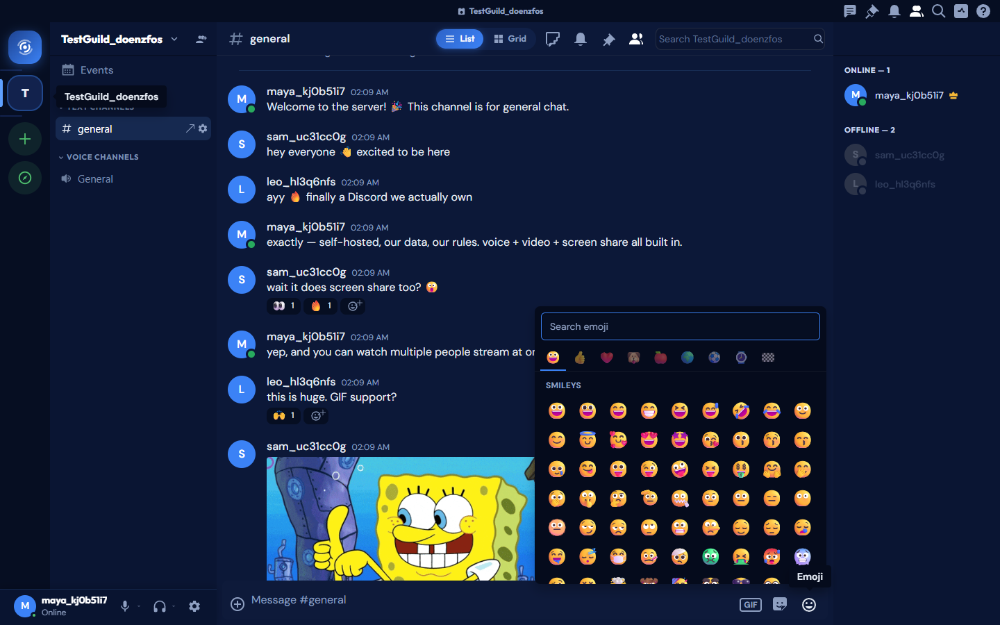 |

| Media gallery | Voice & video settings |
|---|---|
| 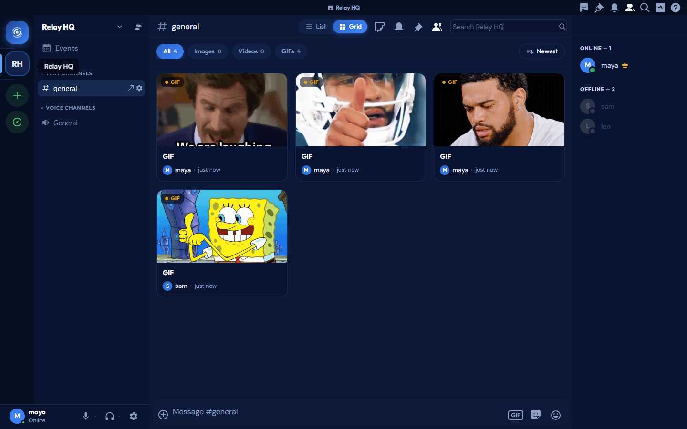 | 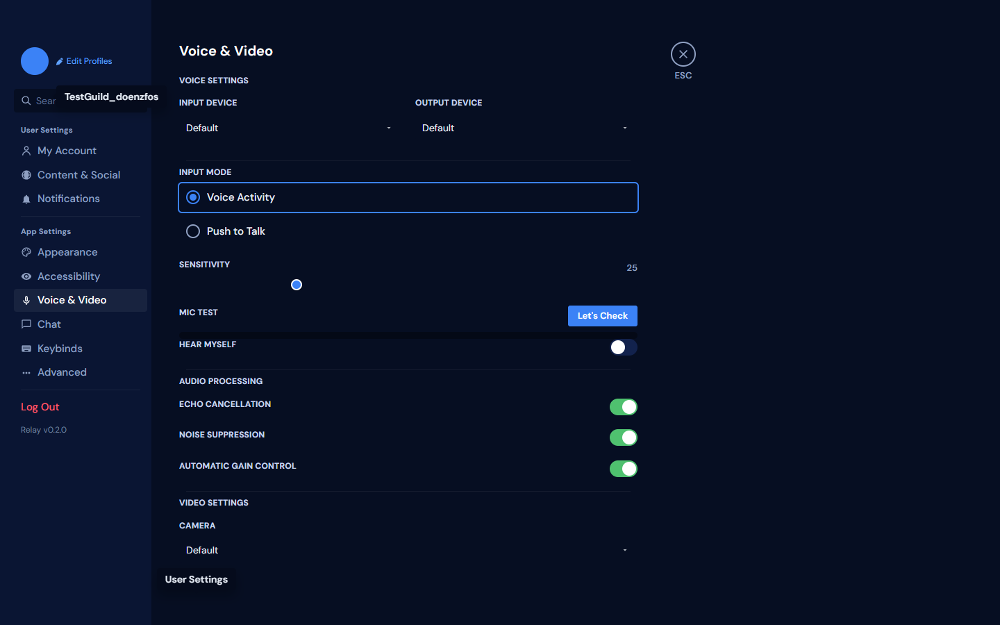 |

## Getting started

You need [Docker Desktop](https://www.docker.com/products/docker-desktop/) (Windows/macOS) or
Docker Engine + Compose (Linux). That's the only prerequisite — Node, Python, Rust, and Postgres
all run inside containers, so you don't install any of them yourself.

### Windows: double-click and go

1. Install Docker Desktop and let it start.
2. Clone or download this repo anywhere you like.
3. Double-click **`Relay.bat`**.

That's it. The script makes sure Docker is running (and starts Docker Desktop if it isn't),
builds and launches the whole stack, waits for it to come up, and opens Relay for you. The
**first run pulls and builds everything, so give it a few minutes**; after that it's quick. It
figures out where the repo lives from its own location, so it works wherever you put it.

### Any OS: Docker Compose

From the project folder:

```sh
docker compose up
```

Then open **`https://localhost:5173`**. Local HTTPS uses a self-signed certificate, so your
browser shows a one-time "your connection is not private" warning — click *Advanced → proceed*
and you're through. Want to change a default (credentials, the GIPHY key, HTTPS, SMTP, backups)?
Copy `.env.example` to `.env` first, then edit it — every knob it lists is read by
`docker-compose.yml`. (Ports and internal service URLs are fixed in `docker-compose.yml` itself.)

### Build the desktop app

The desktop app is a thin native shell around the same client, pointed at your server. To build
an installer for your platform:

```sh
pnpm --filter @relay/desktop install
pnpm --filter @relay/desktop build      # or build:win / build:mac / build:linux
```

Set `RELAY_URL` to your server's address if it isn't the local default.

### Log in or sign up

First launch drops you on the sign-in screen. Hit **Create an account** to make your own —
or, for a quick look around, enable the optional
[demo accounts](#demo-accounts-optional-off-by-default) and a ready-made community.

| Sign in | Create an account |
|---|---|
| 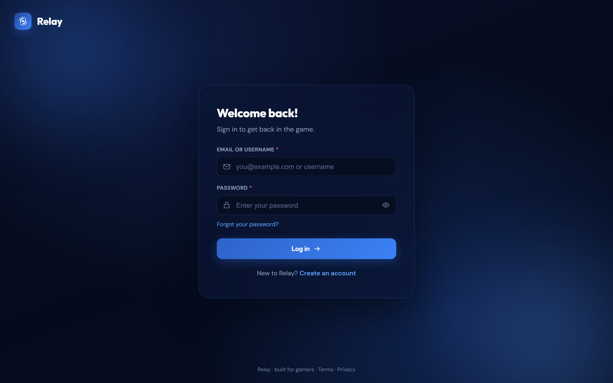 | 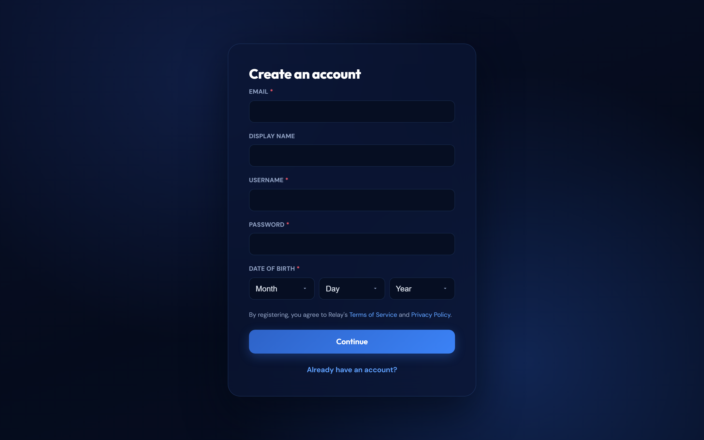 |

Once you're in, the **+** on the left rail spins up your first server. If you enabled demo
seeding (above), a small demo community ("Relay HQ") comes with it so there's something to
poke at right away.

| Create a server | Settings |
|---|---|
| 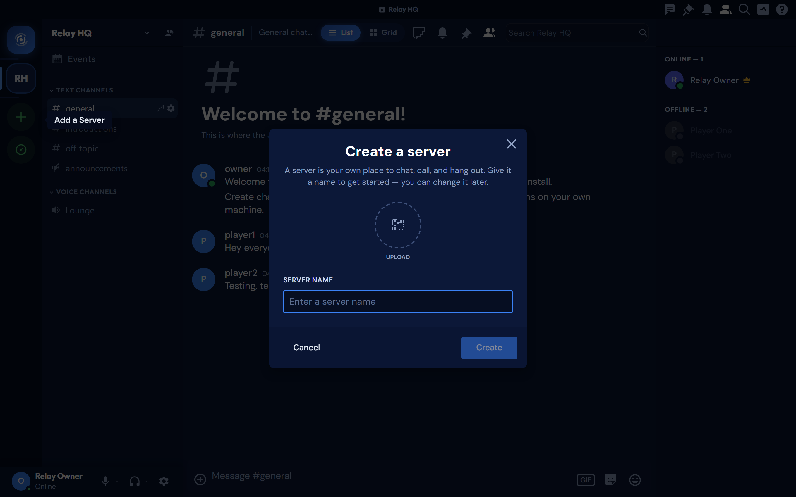 | 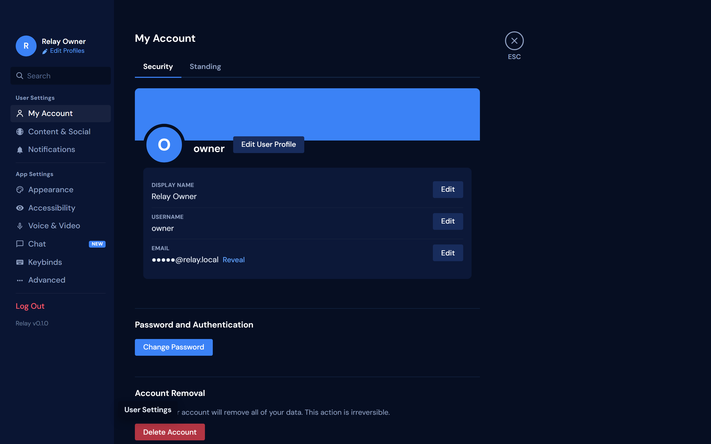 |

**Guides:** [Using Relay](docs/USER-GUIDE.md) — a tour of servers, channels, voice, roles, and
moderation · [Deploying & configuring](docs/DEPLOYMENT.md) — env settings, backups, and what to
lock down before you put it on the internet.

## Demo accounts (optional, off by default)

For local development you can seed three ready-to-go accounts — `owner` (demo server
owner/admin), `player1`, and `player2` — plus a small demo community ("Relay HQ"). They're
**off by default and never ship with a password**: no shared credential lives in the repo,
so a fresh public deployment can't be logged into with a known account. To enable them for
your own machine, set both in your **`.env`** (which is gitignored):

```sh
RELAY_SEED_DEMO=true
# argon2id hash of the password you want the demo accounts to have. Generate it once the
# stack is up (pick any password):
#   docker exec relay-api python -c "from argon2 import PasswordHasher; print(PasswordHasher().hash('choose-a-password'))"
RELAY_DEMO_PASSWORD_HASH=$argon2id$v=19$m=65536,t=3,p=4$...
```

Then start with a fresh database (the seed only runs when the Postgres volume is first
created): `docker compose down -v && rm -rf backups/*` before starting again wipes all local
data — the `rm` matters because the hourly backup sidecar keeps snapshots in `./backups`, and
a fresh start restores the newest one automatically. Log in with a username (or its
`@relay.local` email) and the password you hashed. **Leave demo seeding off for any real
deployment.**

## How it's put together

Relay is a monorepo. Each piece does one job:

- **`packages/client`** — the client (React, Vite, TypeScript, Redux). Runs in the browser and
  inside the desktop app.
- **`packages/desktop`** — the native desktop shell (Electron) for Windows, macOS, and Linux.
- **`services/gateway`** — the real-time WebSocket gateway (Elixir/OTP, Cowboy).
- **`services/voice-server`** — WebRTC voice and video (Node, mediasoup).
- **`services/api`** — the HTTP API (Python, FastAPI).
- **`services/data-services`** — the data layer over gRPC (Rust, tonic, sqlx).

Postgres, Redis, Elasticsearch, and MinIO back it, all wired up in `docker-compose.yml`.

## Status

Relay is pre-1.0 and moves fast. The core — servers, channels, roles, voice, video, screen
share, chat, search, moderation — works and is what the screenshots show. Some edges are still
being smoothed, and a few conveniences (published auto-update releases, deep links into the
desktop app) aren't wired up yet. If you hit something rough,
[open an issue](CONTRIBUTING.md).

## Contributing

Contributions are welcome — start with [`CONTRIBUTING.md`](./CONTRIBUTING.md). Contributions
require agreeing to the [Contributor License Agreement](./CLA.md). Found a security problem?
Please report it privately per [`SECURITY.md`](./SECURITY.md) rather than opening a public issue.

## License

Relay is **source-available**, not open source.

- **Free for noncommercial use.** Individuals, gaming clans, hobbyists, students, and
  noncommercial groups can use, modify, self-host, and share Relay for free under the
  [PolyForm Noncommercial License 1.0.0](./LICENSE.md).
- **Commercial use needs a paid license.** Selling it, reselling it, running it as a paid or
  hosted service, or using it to run a for-profit business requires a separate commercial
  license. See [`COMMERCIAL.md`](./COMMERCIAL.md).

© 2026 Liquid ICT. "Relay" and its branding are reserved by the copyright holder; the license
above covers the source code, not the name or logo.

Relay is an independent project, not affiliated with or endorsed by any other chat service.
Product names, logos, and trademarks mentioned anywhere in this project belong to their
respective owners.
